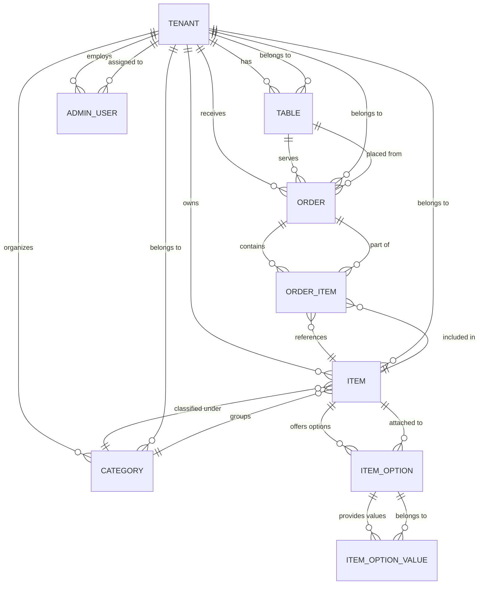

# QRMenu Backend – Entity Relationship Diagram

## Entity Notes

- **Tenant**  
  Core partition key for the platform. Every other entity references a tenant to keep data isolated across restaurants/venues.

- **Table**  
  Physical table in a venue. Holds a unique token used by guests to fetch menus and place orders.

- **Category**  
  Groups menu items (e.g., Appetizers, Drinks). Each category belongs to a single tenant.

- **Item**  
  Actual menu entry. Belongs to both a tenant and a category. Can expose multiple options (sizes, add-ons).

- **ItemOption / ItemOptionValue**  
  Define configurable options for an item. An option belongs to an item and offers one or more values (e.g., `"Size" -> ["Small", "Large"]`).

- **Order / OrderItem**  
  Orders originate from a table and tenant. An order aggregates order items which point back to the item definition for pricing and naming.

- **AdminUser**  
  Staff member for a given tenant. Used for authentication and authorization across the admin endpoints.

This ERD mirrors the relationships encoded by the domain models inside `internal/domain`. Use it as a reference when extending repositories, adding migrations, or updating the OpenAPI specification.
